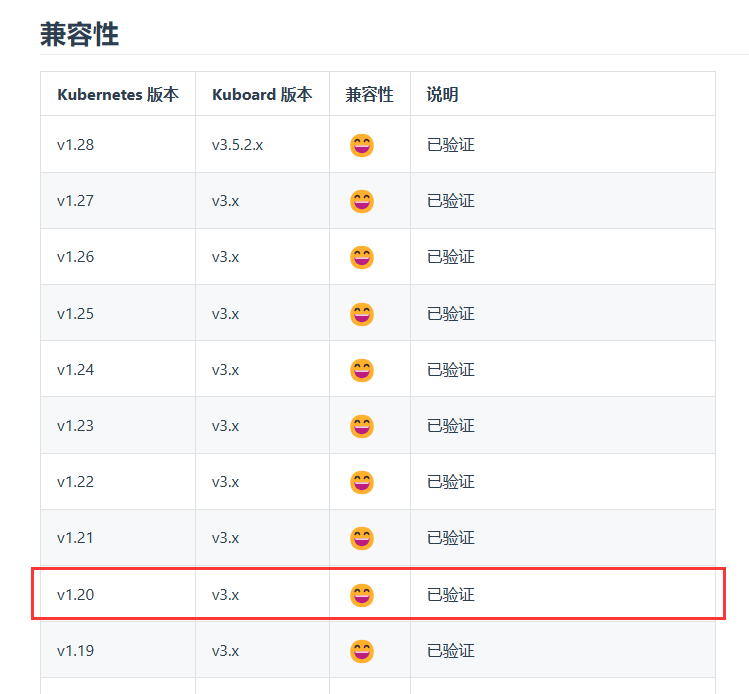
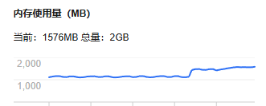
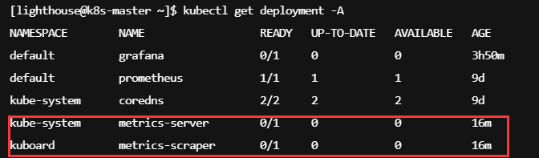
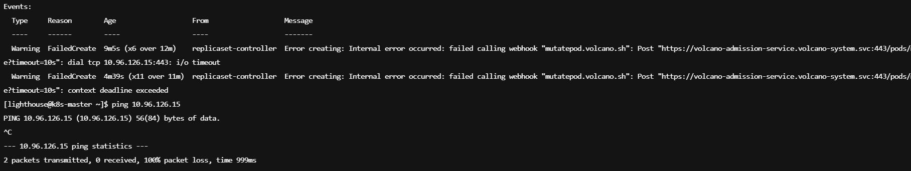
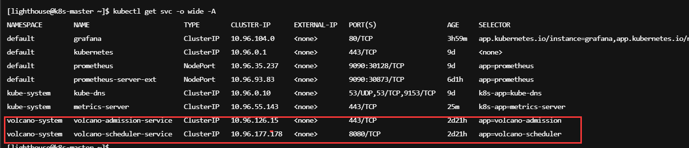

## Kuboard部署

目前使用kubernetes v1.20 兼容kuboard v3.x版本



### 安装方式


**官方推荐使用docker单独运行kuboard集群**

#### docker run方式

##### 官方安装方式

```bash
sudo docker run -d \
  --restart=unless-stopped \
  --name=kuboard \
  -p 80:80/tcp \
  -p 10081:10081/tcp \
  -e KUBOARD_ENDPOINT="http://内网IP:80" \
  -e KUBOARD_AGENT_SERVER_TCP_PORT="10081" \
  -v /root/kuboard-data:/data \
  eipwork/kuboard:v3
```

可以正常启动

**http://110.40.176.8:80/**可正常访问

admin

Kuboard123

##### 添加kubernetes集群

暂时使用token方式

集群信息：

```bash
[lighthouse@k8s-master kuboard]$ kubectl cluster-info
Kubernetes control plane is running at https://10.0.12.11:6443
KubeDNS is running at https://10.0.12.11:6443/api/v1/namespaces/kube-system/services/kube-dns:dns/proxy
```

##### 安装metrics-server/metrics-scraper

第一次执行yaml 机器卡死了



怀疑是内存不足



再次在kuboard 控制台安装 发现未启动

查看replcaset信息发现和volcano webhook有关待解决



但是查看service已经启动




