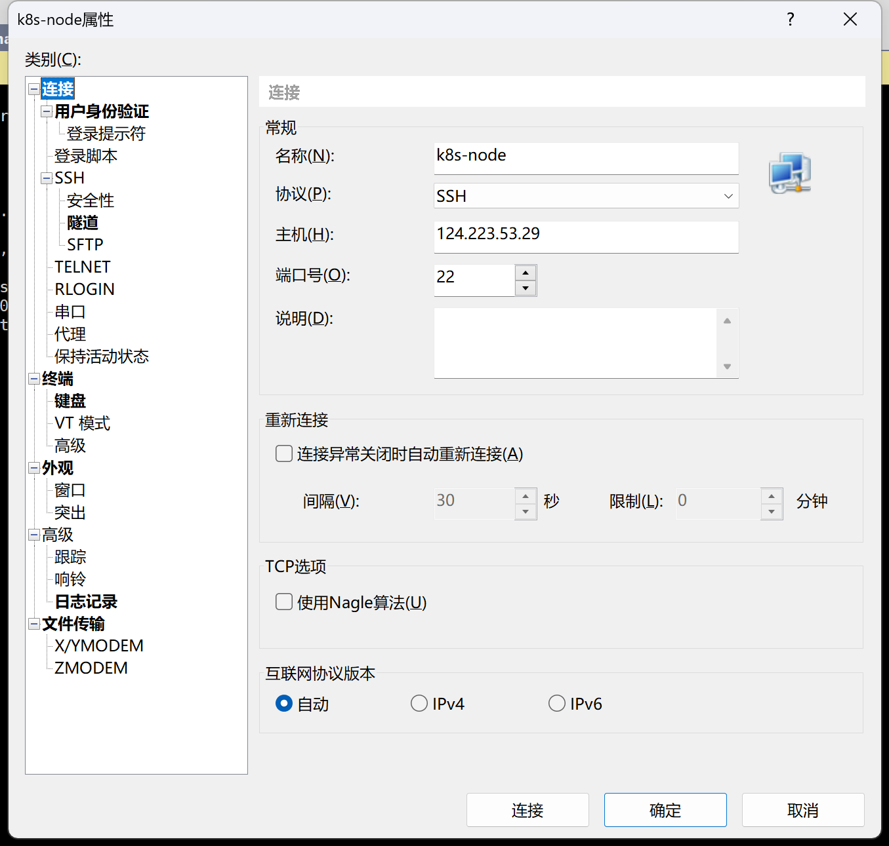

## 腾讯云服务器登录

*使用腾讯云服务器做测试环境*

| hostname   | 公网ip        | 内网ip     |
| ---------- | ------------- | ---------- |
| k8s-master | 110.40.176.8  | 10.0.12.11 |
| k8s-node   | 124.223.53.29 | 10.0.12.15 |
|            |               |            |

### 登录方式 xshell

用户名：lighthouse

密码：wmsjjszdlr119?

